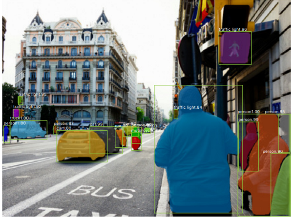

# Mask-rcnn-BDD
This project is based on Facebook's research [MaskRCNN Model](https://github.com/facebookresearch/maskrcnn-benchmark). I will use the PyTorch implimentation of maskrcnn to perform insatnce seggmnetation on the [BDD](https://www.bdd100k.com/) dataset.




 ---
 
 ## Dataset
 Dataset used is BDD100K which is available [here](https://www.bdd100k.com/).
 
 ---
 
## Project Structure
```python
├─docs  # some documents
├─dataset 
│ ├─BDD.py # Dataset class for the data
│ ├─bdd_utils.py  # file that contains some helper methods
├─model
│ ├─Maskrcnn.py # MaskRCNN model loader
├─data
│ ├─images # Images
│ ├─labels # Labels
├─data.yaml # some configuration
├─train.py # training file
├─detect.py # detection file
├─utils.py # usefull functions
```

 ---
## Requirements
```python
pip install -r requirements.txt
```

Go to [weights and biases](https://wandb.ai/home) and create a free account.

Open a command line and run:
```bash
wandb login [API_KEY]
```

instead of `[API_KEY]` put your **API KEY**.

 ---

## Train
```python
python train.py --batch-size 64 --img-size 640 --data 'data/data.yaml' --total_epochs 50
```
 ---
